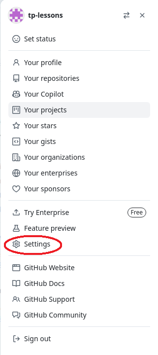
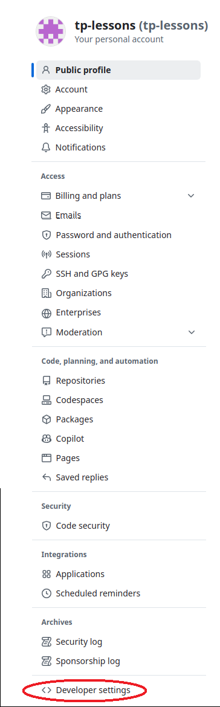
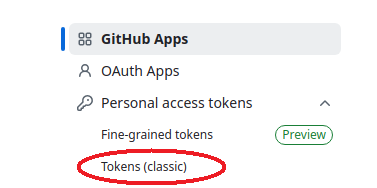
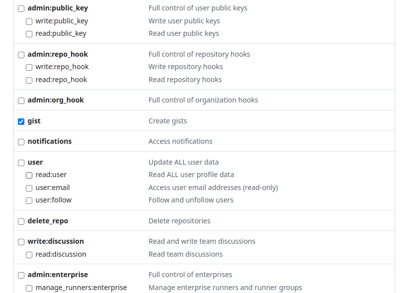

# Получение токена gist

## Переход в настройки пользователя на сайте github.com (для этого нужно авторизоваться)

Выбрать пункт меню "Settings"

## Переход в настройки разработчика (developer settings)

Выбрать пункт меню developer settings

## Переход в раздел выдачи токена

Выбрать пункт меню Personal access tokens -> Tokens (classic)

## Выбор блока разрешений gist

Установить разрешение для gist

